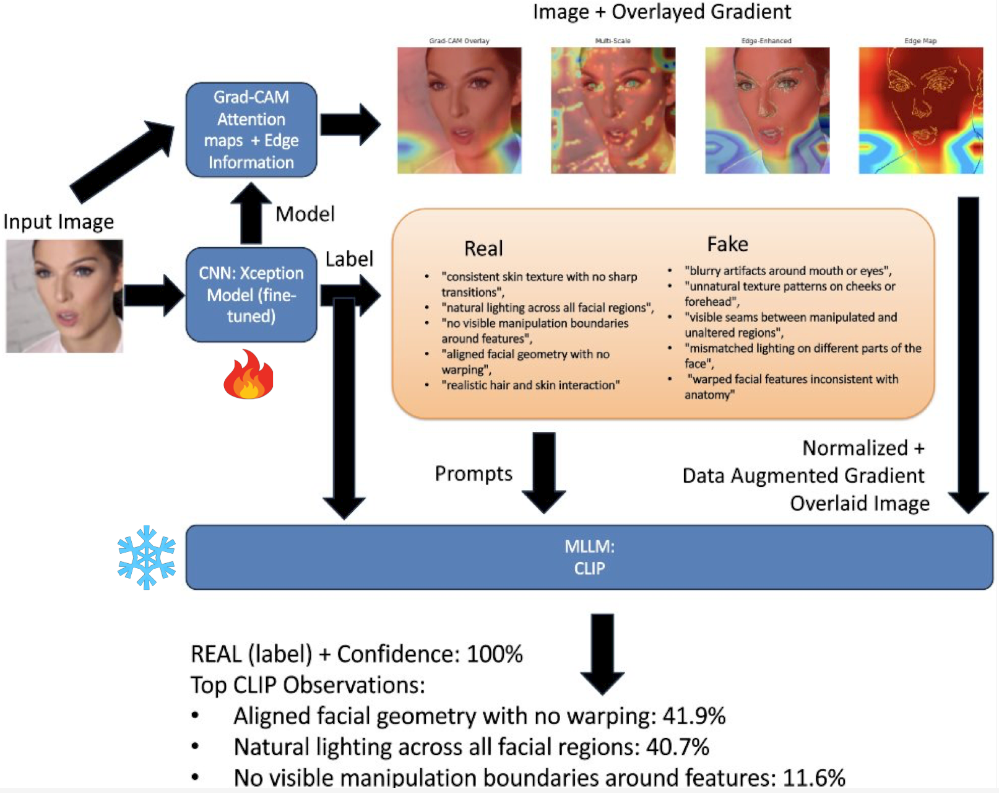
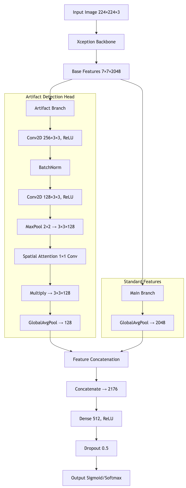
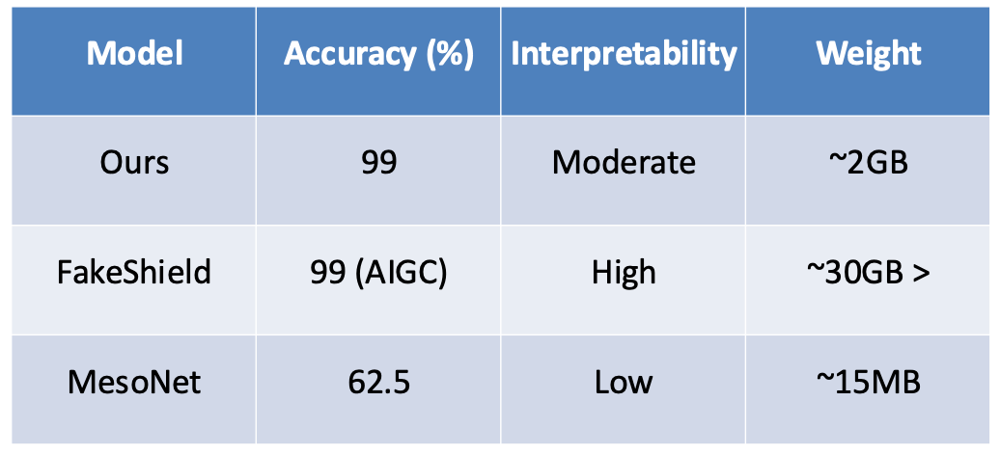

# ECE4880J
UM-SJTU JI 25SU Computer Vision Project

# Lightweight Deepfake Detection and Explainable AI Analysis

## Dataset
I used the preprocessed FF++ dataset that can be found from [M2F2_Det's Project Page](https://github.com/CHELSEA234/M2F2_Det?tab=readme-ov-file). In my case, I used **FF++ (test only)** for smaller dataset due to memory limitation.

## Model Weights
I downloaded the weights of the original model in local files due to network limitation.
I used the weight from **clip-vit-large-patch14-336** for CLIP model.

## Model Architecture
I applied transfer learning on XceptionNet with improved multi-branch artifact detection and saved the images with attention maps. These images later go through CLIP for model interpretability based on the attention distribution.

### Multi-Branch Artifact Detection in XceptionNet

## Result

## Acknowledgement
I am grateful for the contribution from the authors of M2F2_det, FakeShield, XceptionNet, MesoNet and CLIP.